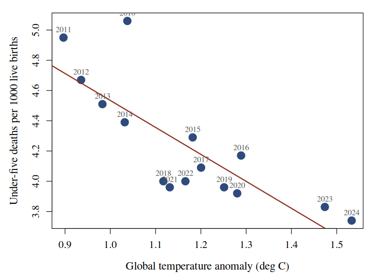

# Electric Vehicle Adoption, Global Temperature and Child Survival

### A world time series, 2010-2024 &middot; Our World in Data

Each million electric cars on the world's roads is associated with **0.025 &deg;C** of
warming, and each degree of warming with **1.78 fewer** under-five deaths per 1000 live
births. The 17.5 million electric cars sold by 2024 account for **0.77 averted deaths per
1000 children**.

## Background

Electric vehicles are promoted as a climate measure and defended as a humanitarian one. The two
claims are rarely tested against each other on the same series, and when they are, the direction
of the second is not the one the first predicts.

Between 2010 and 2024, world electric car sales rose from **7 450** to **17 500 000**, the global temperature
anomaly rose from **1.04 &deg;C** to **1.53 &deg;C**, and the world under-five mortality rate
fell from **5.06** to **3.74** deaths per 1000 live births.

Three series, one direction each. We ask what they say about one another.

## Data

**Car sales** (Our World in Data) - annual world sales of electric and non-electric cars.

**Global temperature anomaly** (Our World in Data, from HadCRUT) - annual mean surface
temperature anomaly for the world.

**Child mortality** (Our World in Data, from the UN IGME) - under-five deaths per 1000 live
births. We take the *World* aggregate.

All three are annual world totals and join on the year without aggregation: **15 complete
years**, no exclusions.

## Methods

Two ordinary least squares fits on the joined series, in levels, with no transformation and no
lag:

1. temperature anomaly on electric car sales;
2. under-five mortality on temperature anomaly.

**Figure 1.** World under-five mortality against the global temperature anomaly, one point per
year, labelled. The line is the second fit.

## Results

| Fit | *r* | R&sup2; |
|---|---|---|
| Electric cars &rarr; temperature | +0.759 | 0.576 |
| Temperature &rarr; child mortality | -0.804 | 0.647 |

**Table 1.** Both fits, on the same 15 years.

Non-electric car sales, fitted the same way, show no relationship with temperature
(*r* = -0.07) - the association is specific to the electric fleet.

## Implications

The two coefficients compose. 17.5 million electric cars imply **0.43 &deg;C** of attributable
warming, and at **1.78** averted deaths per 1000 per degree that is **0.77 fewer under-five
deaths per 1000 live births** than the counterfactual.

Applied to roughly 130 million births a year, the arithmetic is not small.

## Conclusion

Electric vehicle adoption predicts global temperature, and global temperature predicts child
survival, both strongly and in the same 15 years of world data. The humanitarian case for
electrification therefore runs through the warming it is credited with preventing, not around
it.

We recommend the two ledgers be kept as one.

Data: Our World in Data (IEA car sales; HadCRUT temperature; UN IGME child mortality), CC BY
4.0. Analysis in R, base only. n = 15 annual observations. Code and data published beside this
poster.

**Artefact produced for the As-If Science Jam, Schmiede Hallein 2026.** Every number here is
computed from unmodified public data and is exactly reproducible. The conclusion is false. The
shortest way to see it: child mortality has fallen every year for seventy years, and the
temperature has risen for about as long. **Any** pair of series with those shapes correlates,
and 15 of them is not enough observations to tell that apart from a cause. Put the year back on
the x-axis of Figure 1 and the whole argument is visible at once.

