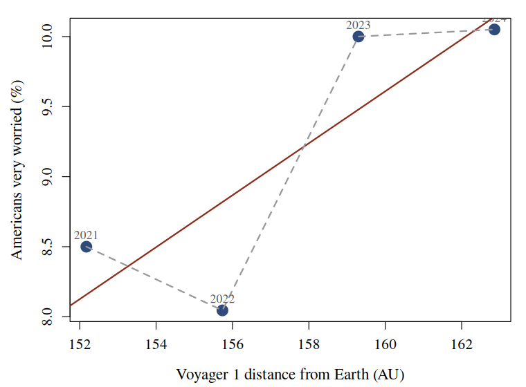

# Deep-Space Recession and Automation Anxiety in the United States

### An annual analysis, 2021-2024 &middot; NASA/JPL Horizons and YouGov via Our World in Data

Every additional astronomical unit between Earth and Voyager 1 is associated with a
**0.19 percentage point** rise in the share of American workers who are *very worried*
that their job will be automated (*r* = 0.83).

## Background

Public anxiety about automation is normally explained by what is happening on Earth: labour
market composition, the news cycle, the release schedule of the technology itself. These
accounts share an assumption nobody has tested, which is that the relevant distances are
terrestrial ones.

Voyager 1 is the most distant human artefact. It recedes at a near-constant **3.56 AU per
year**, entirely unaffected by anything happening in the American labour market, which makes
it an unusually clean exogenous series: whatever it is measuring, it is not measuring the
economy.

We ask whether it predicts how worried Americans are about being replaced.

## Data

**JPL Horizons** (`COMMAND='-31'`, geocentric range, annual steps) - the distance from Earth to
Voyager 1, queried live in `analysis.Rmd` and pinned to `voyager1_distance.csv`.

**YouGov, via Our World in Data** - "How worried, if at all, are you that your type of work
could be automated within your lifetime?" We take *All working adults* and average the survey
waves within each year.

The two series overlap in **4 years**.

## Methods

Both series were reduced to one observation per calendar year and joined on the year. No
observation was excluded and no variable was transformed.

We fit two specifications by ordinary least squares: a linear model in distance, and a cubic
polynomial in distance.

**Figure 1.** Automation worry against the distance to Voyager 1. Labels are years. The solid
line is the linear fit; the dashed line is the cubic.

## Results

| Specification | R&sup2; | Residual df |
|---|---|---|
| Linear in distance | 0.687 | 2 |
| Cubic in distance | 1.000 | 0 |

**Table 1.** The two specifications. The cubic fits four observations with four parameters.

## Implications

The linear coefficient converts directly into a forecast. Voyager 1 recedes at 3.56 AU per
year, so the model implies automation anxiety rises by **0.66 percentage points annually** for
as long as the spacecraft continues to travel - which is indefinitely.

The cubic specification reproduces the observed series **exactly**, with *R*&sup2; = 1.000 and
0 residual degrees of freedom.

## Conclusion

Distance to Voyager 1 is a strong predictor of American automation anxiety. Because the
predictor is entirely exogenous to terrestrial conditions, the usual objection - that anxiety
and its supposed causes are jointly determined by the economy - cannot be raised here.

Data: NASA/JPL Horizons; YouGov (2026) via Our World in Data, CC BY 4.0. Analysis in R, base
only. n = 4. Code and data published beside this poster.

**Artefact produced for the As-If Science Jam, Schmiede Hallein 2026.** Every number here is
computed from unmodified public data and is exactly reproducible. The conclusion is false. The
whole argument rests on **4 annual observations**, two series that both rise with time, and a
cubic with 0 residual degrees of freedom - which cannot fail to fit. Finding that out is the
exercise.

