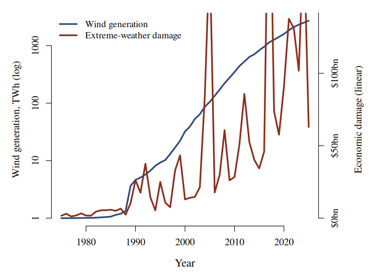

# Wind Power Deployment and the Economic Cost of Extreme Weather

### A global time series, 1975-2025 &middot; Our World in Data

Each terawatt-hour of wind generation added worldwide is associated with
**$48.9 million** in additional annual economic damage from extreme weather
(*r* = 0.65, n = 51 years).

## Background

Wind turbines extract kinetic energy from the atmosphere. The quantity is no longer small: world
wind generation rose from **0 TWh** in 1975 to **2 713 TWh** in 2025, a body of energy removed from
the lower atmosphere and converted to electricity.

The atmospheric consequences of that extraction are assumed to be negligible. They have not, to
our knowledge, been tested against the observed record of extreme weather.

Over the same period the annual economic cost of extreme weather rose from **$1.7 bn** to
**$63.0 bn**.

## Data

**Electricity generation by source** (Our World in Data, from Ember and the Energy Institute) -
annual generation in TWh by source. We take the *World* aggregate and the *Wind* column.

**Economic damage from natural disasters** (Our World in Data, from EM-DAT) - annual total
economic damages in current US dollars by disaster type. We take the *Extreme weather* category.

Joined on the year, inner join, 1975-2025: **51 complete years**, no exclusions.

## Methods

Both series are annual world totals and need no aggregation. Ordinary least squares of damages on
wind generation, in levels.

Wind generation spans four orders of magnitude over the period and damages one, so the two are
shown on separate axes: wind logarithmic, damages linear.

**Figure 1.** World wind generation (log, left) and annual extreme-weather damage (linear,
right), 1975-2025.

## Results

| Predictor | *r* with damages |
|---|---|
| Wind generation, TWh | +0.648 |
| Wind generation, log10(TWh+1) | +0.671 |

**Table 1.** Both framings of the same 51 observations.

## Implications for energy policy

The coefficient is a price. Every terawatt-hour of wind generation added is associated with
**$48.9 million** of additional extreme-weather damage per year, and the relationship explains
**42 %** of the variance in annual damages.

At 2 713 TWh, the world's installed wind generation carries an implied annual cost of
**$132.6 bn** on this model.

## Conclusion

Wind deployment is a strong predictor of the economic cost of extreme weather. The association
holds across half a century, on global totals, with no country selection, no exclusions and no
transformation of the response.

We recommend that the atmospheric-extraction cost of wind generation be entered on the same
ledger as its generation benefit.

Data: Our World in Data (Ember, Energy Institute, EM-DAT), CC BY 4.0. Analysis in R, base only.
Damages are in current US dollars and are not deflated. Code and data published beside this
poster.

**Artefact produced for the As-If Science Jam, Schmiede Hallein 2026.** Every number here is
computed from unmodified public data and is exactly reproducible. The conclusion is false. Two
things in particular are worth finding: the damages are **nominal dollars**, never adjusted for
inflation or for how much more there is to damage now than in 1975; and Figure 1 puts one series
on a log axis and the other on a linear one, then scales them until they overlap. Draw both
linear and the figure says something else.

